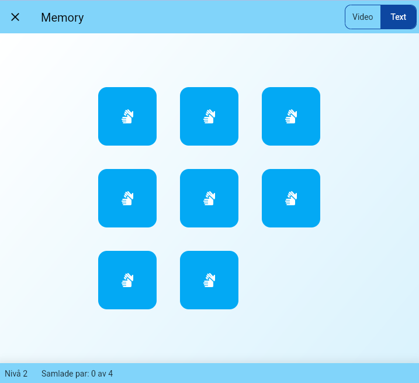

# Memory

A simple memory game built in Flutter using signs and words from [Svenskt teckenspråkslexikon](https://teckensprakslexikon.su.se/). Uses TSP Quiz random API to pick a collection of n random words.

Try yourself at [tspquiz.se/memory/](https://tspquiz.se/memory/) or [Google Play](https://play.google.com/store/apps/details?id=se.tspquiz.memory).



## Build

### Web

```
flutter build web --web-renderer canvaskit --base-href '/memory/app/'
```
